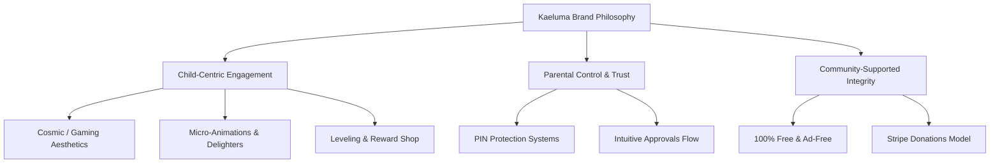

# Kaeluma Brand Style & Design System Guide

Welcome to the comprehensive branding and design guide for **Kaeluma**. This document serves as the single source of truth for the brand identity, user experience design, color systems, component standards, typography, and marketing assets for Kaeluma.

---

## 🌌 1. Brand Essence & Positioning

Kaeluma (formerly "LifeXP") is a **100% free, ad-free gamified chore application** designed to help children turn everyday household responsibilities into rewarding adventure quests.



### Brand Pillars
*   **Gamified Adventure:** Life is a quest. Chores are not tasks; they are "Missions" that award gold coins and XP.
*   **Premium Quality:** Kaeluma is styled like a premium video game console dashboard. It avoids the cheap "kids-app" cartoonish tropes in favor of deep space colors, glowing controls, and modern typography.
*   **Safety & Simplicity:** Built with robust parental boundaries, family-level settings, and strict pin security, ensuring a safe digital space for children.
*   **Open & Altruistic:** By remaining 100% free with no ads, trackers, or subscription paywalls, Kaeluma runs on trust and voluntary support.

### Voice & Tone
*   **Encouraging:** Celebrates child achievements with visual rewards, level-up milestones, and dynamic effects.
*   **Sleek & Clean:** Minimal copy, highly visual, clean interface spacing.
*   **Friendly but Sophisticated:** Appeals to kids aged 6-14 who crave a more adult-like "gaming hub" rather than a childish cartoon look.

---

## 🎨 2. The Color System

Kaeluma's color system is engineered for dark mode, using custom CSS variables (found in [variables.css](file:///c:/Users/jayso/Projects/Kaeluma/src/styles/variables.css)) that implement a modern glowing theme.

### Core Canvas Colors
Used for backgrounds, surface containment, and page-wide styling.

| Variable Name | Hex Code | Visual Swatch | Intent & Application |
| :--- | :--- | :--- | :--- |
| `--bg-deep` | `#0d0d14` | ⚫ | Core canvas background. Deep, cosmic black. |
| `--bg-surface` | `#171723` | ⬛ | Primary container backing. Card backgrounds, navigation panels. |
| `--bg-surface-alt` | `#222234` | 🔳 | Hover states and secondary level surfaces. |
| `--bg-glass` | `rgba(255, 255, 255, 0.03)` | 🌫️ | Translucent floating overlays. |
| `--bg-glass-border`| `rgba(255, 255, 255, 0.08)`| ➖ | Glass component border stroke. |

### Semantic Accent Colors
These colors provide consistent semantic feedback across the application.

| Variable Name | Hex Code | Visual Swatch | Semantic Meaning | Dim Variant |
| :--- | :--- | :--- | :--- | :--- |
| `--gold` | `#facc15` | 🟡 | Coins, rewards, achievements | `rgba(250, 204, 21, 0.15)` |
| `--amber` | `#f59e0b` | 🟠 | High value coin highlights, premium rewards | `rgba(245, 158, 11, 0.15)` |
| `--purple` | `#a855f7` | 🟣 | Level-ups, special themes, crests | `rgba(168, 85, 247, 0.15)` |
| `--cyan` | `#06b6d4` | 🔵 | XP tracks, streak meters, information | `rgba(6, 182, 212, 0.15)` |
| `--green` | `#22c55e` | 🟢 | Actions, approvals, success states | `rgba(34, 197, 94, 0.15)` |
| `--red` | `#ef4444` | 🔴 | Danger, deletions, errors, wrong PINs | `rgba(239, 68, 68, 0.15)` |

### Glow Effects
To support the neon gaming aesthetic, key elements utilize glowing shadows:
*   **Gold Glow (`--glow-gold`):** `0 0 20px rgba(250, 204, 21, 0.25)`
*   **Green Glow (`--glow-green`):** `0 0 20px rgba(34, 197, 94, 0.25)`
*   **Purple Glow (`--glow-purple`):** `0 0 20px rgba(168, 85, 247, 0.25)`
*   **Cyan Glow (`--glow-cyan`):** `0 0 20px rgba(6, 182, 212, 0.25)`

---

## 🎭 3. Dynamic Tier Theme System

One of Kaeluma's core gamification loops is unlockable interface themes based on child levels. These are declared as specific theme classes in [variables.css](file:///c:/Users/jayso/Projects/Kaeluma/src/styles/variables.css) and reassign `--primary`, `--primary-dim`, and `--glow-primary` variables dynamically.

### Theme Categorization

| Tier / Level Range | Theme Class | Primary Hex | Tone & Design Direction |
| :--- | :--- | :--- | :--- |
| **Level 1 (Starter)** | `.theme-seedling` <br> `.theme-bubblegum` <br> `.theme-ocean` | `#4ade80` <br> `#f472b6` <br> `#38bdf8` | **Fresh & Playful:** High contrast, bright organic neon tones. |
| **Level 3 - 10** | `.theme-morning-sky` <br> `.theme-lavender-mist` <br> `.theme-golden-hour` <br> `.theme-mint` | `#7dd3fc` <br> `#c084fc` <br> `#fbbf24` <br> `#34d399` | **Pastel Dream:** Soft, magical sky gradients and cozy morning glows. |
| **Level 12 - 25** | `.theme-coral` <br> `.theme-sunny` <br> `.theme-forest-deep` <br> `.theme-sky` <br> `.theme-violet` | `#fb7185` <br> `#facc15` <br> `#059669` <br> `#0ea5e9` <br> `#8b5cf6` | **Vivid Realms:** Grounded nature tones combined with cosmic deep sky blues. |
| **Level 30 - 45** | `.theme-crimson` <br> `.theme-teal` <br> `.theme-stone` <br> `.theme-candle-flame` | `#e11d48` <br> `#14b8a6` <br> `#94a3b8` <br> `#f59e0b` | **Ember & Stone:** Industrial, magma-based fires and metallic dark accents. |
| **Level 50 - 70** | `.theme-indigo` <br> `.theme-ruby` <br> `.theme-emerald` <br> `.theme-sapphire` <br> `.theme-amethyst` | `#6366f1` <br> `#be123c` <br> `#10b981` <br> `#1d4ed8` <br> `#7e22ce` | **Precious Gemstones:** Deep jewel-like glows representing mastery. |
| **Level 75 - 90** | `.theme-neon-pink` <br> `.theme-neon-cyan` <br> `.theme-electric-blue` <br> `.theme-plasma` | `#ff00ff` <br> `#00ffff` <br> `#2563eb` <br> `#39ff14` | **Cyberpunk Neon:** 50% opacity intense glows for extreme contrast. |
| **Level 92 - 100** | `.theme-sunset-split` <br> `.theme-midnight-split` <br> `.theme-galactic` <br> `.theme-magma` <br> `.theme-rainbow` <br> `.theme-everlight` | `#f97316` <br> `#4338ca` <br> `#9d174d` <br> `#ea580c` <br> `#00ffcc` <br> `#fbbf24` | **Epic Splashes:** Deep space nebula gradients and high-end aura pulses. |

---

## 🔤 4. Typography

Typography in Kaeluma uses clean lines and heavy weights to evoke a modern arcade/dashboard appearance.

*   **Primary Font Family:** **Outfit** (via Google Fonts). Falls back to `system-ui, -apple-system, sans-serif` if web fonts are unavailable.
*   **Header Weight Hierarchy:**
    *   `font-weight: 900` (Black) - Brand names, promotional announcements, and level badges.
    *   `font-weight: 800` (ExtraBold) - Main Page Titles.
    *   `font-weight: 700` (Bold) - Card headers, modal headlines, stats.
*   **Body Text Weights:**
    *   `font-weight: 600` (SemiBold) - Button texts, navigation items, form inputs.
    *   `font-weight: 400` (Regular) - Meta-text, instructions, subtext.

### Text Colors

| Variable Name | Hex Code | Application |
| :--- | :--- | :--- |
| `--text-bright` | `#f8fafc` | Main readable text, headings, white symbols. |
| `--text-muted` | `#94a3b8` | Subheadings, card body text, secondary details. |
| `--text-dim` | `#475569` | Unfocused inputs, placeholders, locked features. |

---

## 📐 5. Spacing, Radius, & Layout System

Kaeluma uses a strict spacing and radius system to maintain a premium feel. The layout avoids cluttered lines in favor of breathing room.

### Spacing Scale
Declared as padding and margin variables in CSS:
*   `--space-xs: 4px` — Label gaps, tiny button paddings.
*   `--space-sm: 8px` — Grid item gap, element group spacing.
*   `--space-md: 16px` — Card inner paddings, list row gaps.
*   `--space-lg: 24px` — Main component padding, page header gaps.
*   `--space-xl: 32px` — Section separations, modal padding.
*   `--space-2xl: 48px` — Empty states, layout margins.

### Border Radius System
Rounder corners create a kid-friendly but sleek digital environment.
*   `--radius-sm: 12px` — Tiny pickers, small inputs.
*   `--radius-md: 18px` — Standard buttons, input elements.
*   `--radius-lg: 24px` — Cards, containers, modals.
*   `--radius-xl: 32px` — Outermost panel cards, overlays.
*   `--radius-full: 9999px` — XP bar tracks, badges, pill buttons.

---

## 🧱 6. UI Component Design Patterns

All CSS components are modularly designed and reside in [components.css](file:///c:/Users/jayso/Projects/Kaeluma/src/styles/components.css). Below are the specifications for rebuilding or designing new elements.

### Glassmorphic Spec
All container elements (like cards, modals, and input areas) float above the deep background using a glass-like shell.
```css
background: var(--bg-surface);
border-radius: var(--radius-lg);
border: 1px solid var(--bg-glass-border);
box-shadow: inset 0 1px 0 rgba(255, 255, 255, 0.05), 0 4px 20px rgba(0, 0, 0, 0.4);
```

### Button Specifications
Buttons must be visual focal points with tactile feedback.

1.  **Tactile Press Animation:**
    To ensure hitboxes never shrink (which causes micro-delays or missed clicks on touch screens), Kaeluma avoids scale-based shrinking transforms on button click. Instead, it uses a brightness-dimming inset shadow:
    ```css
    .btn:active {
      filter: brightness(0.82) !important;
      box-shadow: inset 0 2px 6px rgba(0,0,0,0.35) !important;
      transition: filter 0.05s, box-shadow 0.05s !important;
    }
    ```
2.  **Button Variations:**
    *   **Primary Button (`.btn-primary`):** Utilizes the active theme color (`--primary`) and glow shadow (`--glow-primary`).
    *   **Gold Button (`.btn-gold`):** A custom amber-gold gradient (`linear-gradient(135deg, var(--gold), var(--amber))`) with dark navy text. Reserved for Stripe Donations, critical actions, and level-ups.
    *   **Ghost Button (`.btn-ghost`):** Glass background with a light border, merging smoothly with the canvas.
    *   **Success Button (`.btn-success`):** Emerald green, used for approvals and completed tasks.
    *   **Danger Button (`.btn-danger`):** Red, used for deletions and reset options.

### Cards & Badges
*   **Hover Interactivity:** Interactive cards scale up slightly (`translateY(-2px)`) and increase border-opacity to feel reactive.
*   **Inset Theme Glows:** Cards can highlight coins or magic with thematic borders:
    *   `.card-glow-gold`: Golden border glow (`rgba(250, 204, 21, 0.2)`).
    *   `.card-glow-purple`: Purple border glow (`rgba(168, 85, 247, 0.2)`).
*   **Badges:** Small pill shapes (`--radius-full`) with `0.75rem` uppercase text. They must use the dim variant of their color as the background and the full-saturation accent for the text (e.g. `.badge-gold` uses `--gold-dim` bg and `--gold` text).

---

## 🏃 7. Motion & Interaction Guidelines

Animations are vital to making Kaeluma feel alive. Motion is smooth, using ease-out cubic beziers.

### Transition Timing
*   **Fast (`--duration-fast: 150ms`):** Hover states, input focus transitions, press feedback.
*   **Normal (`--duration-normal: 300ms`):** Card pop-ins, page navigation slides, tab switching.
*   **Slow (`--duration-slow: 600ms`):** Modals opening, overlays.

### Micro-Animations
*   **Wrong PIN (Shake):** Shake animation shakes the PIN pad horizontally if validation fails.
*   **Coin Shake (`shake-coin`):** Gently wobbles gold coins when hovered or earned.
*   **Crest Animations:** Unlockable avatar crests possess unique idle movements:
    *   `.crest-sway`: Swaying back-and-forth like a pendulum (`4s` loop).
    *   `.crest-pulse`: Pulsing size and opacity (`2s` loop).
    *   `.crest-spin-slow`: Slowly spinning backgrounds (`12s` linear loop).
    *   `.crest-float`: Hovering floating loop (`3s` loop).
    *   `.crest-flicker`: Aura flicker simulating fire (`3s` loop).
*   **Level-Up Celebrations:** Shows popping confetti, scaling badges, and a heavy text-shadow pulse (`levelUpGlow`).

---

## 🪙 8. The Gold Coin System

Kaeluma uses a central gold coin currency. To ensure consistent visual representation, **never use standard emoji symbols (🪙)**, because Windows OS displays them as flat silver metal, violating the brand color.

Instead, always import and use the custom **`<GoldCoin />` component** ([GoldCoin.js](file:///c:/Users/jayso/Projects/Kaeluma/src/components/GoldCoin.js)).

### GoldCoin Technical Specification
```jsx
// Renders an inline SVG gold coin with premium metallic gold gradients
import React, { useId } from 'react';

export default function GoldCoin({ className = "w-5 h-5 inline-block" }) {
  const gradientId = useId();
  return (
    <svg className={className} viewBox="0 0 24 24" fill="none" xmlns="http://www.w3.org/2000/svg">
      <circle cx="12" cy="12" r="10" fill={`url(#outer-${gradientId})`} stroke={`url(#border-${gradientId})`} strokeWidth="1.5"/>
      <circle cx="12" cy="12" r="7" fill={`url(#inner-${gradientId})`} stroke={`url(#border-${gradientId})`} strokeWidth="1"/>
      <path d="M12 7V17M9 10H14C15 10 15 12 12 12.5C9 13 9 15 13 15H15" stroke="#78350F" strokeWidth="1.5" strokeLinecap="round" strokeLinejoin="round"/>
      <defs>
        <linearGradient id={`outer-${gradientId}`} x1="0" y1="0" x2="24" y2="24" gradientUnits="userSpaceOnUse">
          <stop stopColor="#FBBF24"/>
          <stop offset="0.5" stopColor="#F59E0B"/>
          <stop offset="1" stopColor="#D97706"/>
        </linearGradient>
        <linearGradient id={`inner-${gradientId}`} x1="4" y1="4" x2="20" y2="20" gradientUnits="userSpaceOnUse">
          <stop stopColor="#FEF08A"/>
          <stop offset="0.7" stopColor="#F59E0B"/>
          <stop offset="1" stopColor="#B45309"/>
        </linearGradient>
        <linearGradient id={`border-${gradientId}`} x1="0" y1="0" x2="24" y2="24" gradientUnits="userSpaceOnUse">
          <stop stopColor="#FFFFFF" stopOpacity="0.4"/>
          <stop offset="1" stopColor="#78350F" stopOpacity="0.6"/>
        </linearGradient>
      </defs>
    </svg>
  );
}
```

---

## 🗄️ 9. Marketing & Social Asset Directory

The `branding/` folder contains generated PNG graphics for launches, store fronts, and social campaigns. 

> [!TIP]
> Since the project creator has an active Adobe Creative Suite subscription, these PNGs are generated as 300dpi master-ratio images. You can import them directly into **Adobe Photoshop** or **Adobe Illustrator** as base canvas templates, add tailored text elements, overlays, or product feature callouts, and export them as pixel-perfect campaigns.

### Social & Promo Media Catalog

| Asset Filename | Dimensions | Aspect Ratio | Primary Use Case |
| :--- | :--- | :--- | :--- |
| **[logo_main.png](logo_main.png)** | *Vector-aligned* | Variable | Main horizontal branding header. Includes the sun icon with the "Kaeluma" gradient logotype. |
| **[logo_icon.png](logo_icon.png)** | 512×512 | 1:1 | App Icon, favicon, avatar, Stripe checkout, or App Store logo badge. |
| **[banner.png](banner.png)** | 1920×1080 | 16:9 | Launch banner, website hero backgrounds, blog post banners. |
| **[social_square_post.png](social_square_post.png)** | 1080×1080 | 1:1 | Instagram post feed, Facebook update, LinkedIn project preview. |
| **[twitter_header.png](twitter_header.png)** | 1500×500 | 3:1 | Twitter/X Profile header illustration. |
| **[facebook_cover.png](facebook_cover.png)** | 820×312 | 2.63:1 | Facebook page banner. |
| **[story_missions.png](story_missions.png)** | 1080×1920 | 9:16 | Vertical mobile showcase focusing on Child Questing/Missions. |
| **[story_rewards.png](story_rewards.png)** | 1080×1920 | 9:16 | Vertical mobile showcase focusing on the Reward Shop. |
| **[app_store_feature.png](app_store_feature.png)** | 1280×720 | 16:9 | Google Play Feature Graphic, App Store preview cover, or Product Hunt card. |
| **[og_share_card.png](og_share_card.png)** | 1200×630 | 1.91:1 | Open Graph preview card for Slack, Discord, Facebook messenger. |
| **[email_hero.png](email_hero.png)** | 600×300 | 2:1 | Newsletter welcome banner. |
| **[coin.png](coin.png)** | 512×512 | 1:1 | Isolated 3D high-fidelity Gold Coin graphic. |
| **[video_bg.png](video_bg.png)** | 1080×1920 | 9:16 | Video backdrop overlay for TikTok/YouTube Shorts. Import into Premiere Pro or After Effects. |

---

## 🚫 10. Design Do's & Don'ts

To ensure the Kaeluma brand retains its high-fidelity appearance, follow these simple rules:

### DO ✅
*   Use the dynamic tier theme variables (`--primary`) for all core action buttons rather than hardcoding static greens or blues.
*   Enforce Outfit as the typography family for all titles. Keep titles in heavy weights (`800`/`900`).
*   Always use the `<GoldCoin />` component instead of `🪙` or other generic coins.
*   Maintain the dark mode interface. Never style white backgrounds or solid bright grey panels.
*   Make sure parent actions always request PIN confirmation with error fallback states.

### DON'T ❌
*   Do not overlay text directly on backgrounds without utilizing a glassmorphic container (`.card` or `.btn-ghost`).
*   Do not scale down buttons on click; use the brightness overlay to avoid touch misses.
*   Do not use hard borders or harsh angles; always apply `--radius-md` or `--radius-lg`.
*   Do not add subscription references or commercial paywall branding. The Stripe link is exclusively for **donations** (`https://donate.stripe.com/28EfZg6aG81Of5zd8ggQE00`).
*   Do not use standard, low-contrast system fonts for landing page highlights.

---

This branding guide will help developers, designers, and copywriters maintain visual consistency and protect the magical, premium feel of Kaeluma. Let's make chore time an epic adventure!
