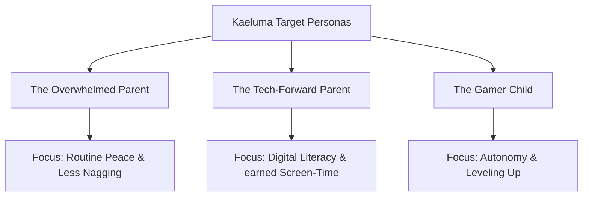

# Kaeluma Brand Messaging & Copywriting Playbook
### Crafting a Consistent Voice across Parent Sanctuaries and Kid Guilds

This messaging playbook is the definitive copy guide for Kaeluma. It defines our voice, core taglines, vocabulary limits, and targeted messaging strategies to ensure that Kaeluma speaks with consistent clarity to parents, partners, and children.

---

## 📢 1. Core Slogans & Taglines

### The Primary Slogan (Hero Title)
> "Turn chore time into an epic adventure."
*Use cases: Website hero banners, app store headers, email footers, and press kit titles.*

### The Action Tagline
> "Gamify household routines. Empower childhood autonomy."
*Use cases: Meta descriptions, social media bios, and corporate summaries.*

### The Parent-Centric Hook
> "Ditch the nagging. Welcome the harmony."
*Use cases: Ad copy, parent onboarding screens, and PTA flyers.*

---

## ⚡ 2. The Elevator Pitches

### The 10-Second Pitch (The Headline)
> "Kaeluma is a 100% free, game-console-inspired task dashboard that turns routine household chores into rewarding adventure quests, replacing parental nagging with self-directed child autonomy."

### The 30-Second Pitch (The Detail)
> "Kaeluma (formerly 'LifeXP') gamifies childhood routines by transforming household responsibilities into interactive quests. Children log into their own gaming-style dashboard to select tasks, earn gold coins, and level up their avatars. Parents maintain complete boundary control in a PIN-protected sanctuary, configuring their own reward shops where children can redeem coins for screen time, outings, or allowances. Built by a parent, Kaeluma is completely free, has no ads or trackers, and runs entirely on voluntary community support."

---

## ✍️ 3. Kaeluma Brand Vocabulary
*To maintain the gaming guild vibe, use these specific brand translations throughout all interfaces and marketing materials.*

### Words to ALWAYS Use ✅
*   **Quest** (Instead of *Chore*, *Task*, or *Duty*) — Evokes adventure and voluntary action.
*   **Gold Coin** (Instead of *Money*, *Allowance*, or *Cash*) — Keeps the economy virtual and gamified.
*   **Reward Shop** (Instead of *Store*, *Payout*, or *Redemption Center*) — Emphasizes fun and parent-approved prizes.
*   **Parent Sanctuary** (Instead of *Admin Dashboard*, *Settings*, or *Control Panel*) — Positions the parent's area as a safe, peaceful space of design and review.
*   **Family Guild** (Instead of *Household*, *User Account*, or *Profiles*) — Promotes a sense of unified, collaborative adventure.
*   **Guild Member** (Instead of *Child User* or *Sub-Account*) — Validates the child as an equal contributor to the household.

### Words to AVOID ❌
*   **Nagging / Taskmaster** — Implies negative parental pressure. Frame Kaeluma as an "automated guide."
*   **Allowance / Paycheck** — Avoid tying chores to mandatory cash. Focus on "earned privileges."
*   **Subscription / Paywall / Premium** — Kaeluma is 100% free; referencing commercial boundaries weakens our brand integrity.
*   **Child Tracker** — Sounds surveillance-focused. Use "autonomy coordinator" or "routine tracker."

---

## 👥 4. Audience Persona Profiles & Copy Hooks
*Use these specific messaging hooks when tailoring copy to different family members.*

### Persona A: The Overwhelmed Parent (The Routine Restorer)
*   **Pain Point:** Exhausted by repeating bedtime instructions five times. Frustrated by static sticker charts.
*   **Copy Angle:** Focus on morning silence, automated task tracking, and restoring household peace.
*   **Sample Copy Hook:** 
    > "Imagine a morning where you don't say 'brush your teeth' once. With Kaeluma, the quest log does the talking. Your child completes their checklist, clicks complete, and waits for your gold-star approval. No nagging required."

### Persona B: The Tech-Forward Parent (The Future Planner)
*   **Pain Point:** Struggling to manage screen-time boundaries. Wants to teach financial opportunity cost.
*   **Copy Angle:** Focus on earned privileges, digital coin systems, and teaching kids the value of savings.
*   **Sample Copy Hook:**
    > "Teach opportunity cost without the cash. In Kaeluma's Reward Shop, screen-time is earned, not demanded. Your child learns to budget their gold coins, deciding between instant screen-time loot or saving up for a weekend movie guild night."

### Persona C: The Gamer Child (The Routine Hero)
*   **Pain Point:** Feels micromanaged by parents. Finds chores boring and childish.
*   **Copy Angle:** Focus on dashboard control, avatar leveling, and choosing their own path.
*   **Sample Copy Hook:**
    > "Level up your daily guild. Take control of your quest log, earn gold coins, and unlock 32 epic interface themes as you level up your avatar rank."
